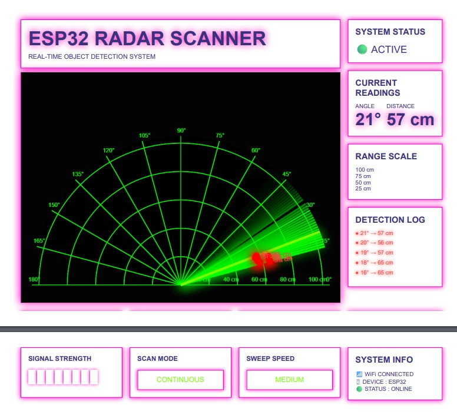
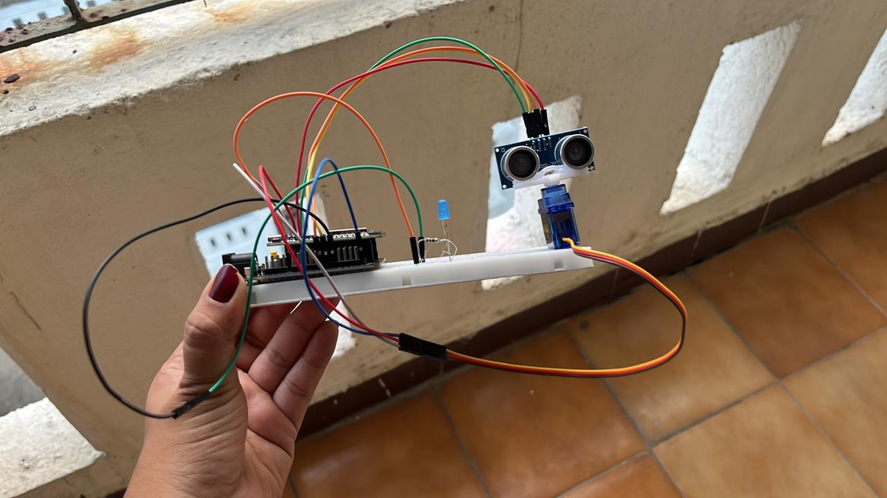
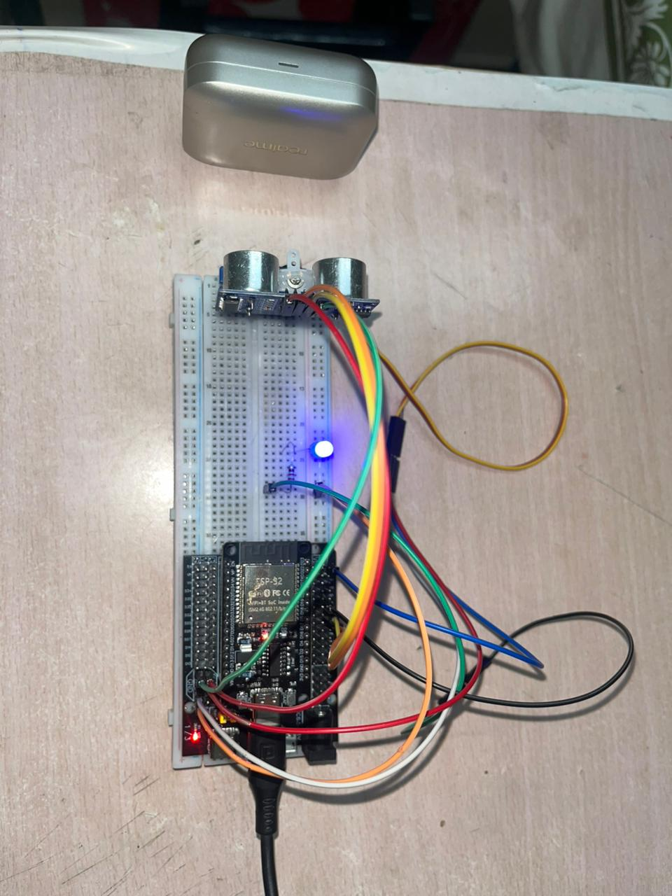
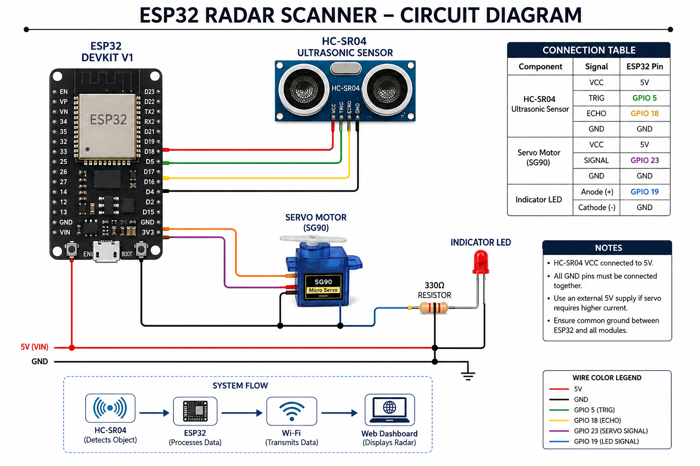

# 🚀 ESP32 Radar Scanner

A futuristic military-style radar scanner built using ESP32, HC-SR04 ultrasonic sensor, servo motor, and a real-time web dashboard.

This project combines:

- Embedded Systems
- IoT
- Real-Time Data Visualization
- Web Development
- Sensor Interfacing

The ESP32 scans surroundings using an ultrasonic sensor mounted on a servo motor and transmits live radar data to a futuristic HUD-style web interface over WiFi.

---

# 📸 Project Showcase

## 🛰 Radar Dashboard



---

## 🔧 Hardware Setup



---

## 🎯 Detection Demo



---

## 🔌 Circuit Diagram



---

# ⚡ Features

✅ Real-time radar scanning  
✅ WiFi-based live monitoring  
✅ Futuristic military HUD interface  
✅ Servo-based 180° scanning  
✅ Ultrasonic object detection  
✅ Red glowing target indicators  
✅ Detection logs  
✅ Radar sweep fading effect  
✅ Distance labels  
✅ Responsive web dashboard  

---

# 🛠 Hardware Components

| Component | Quantity |
|---|---|
| ESP32 Dev Board | 1 |
| HC-SR04 Ultrasonic Sensor | 1 |
| SG90 Servo Motor | 1 |
| LED | 1 |
| Breadboard | 1 |
| Jumper Wires | Multiple |

---

# 🔌 Pin Connections

| Component | ESP32 Pin |
|---|---|
| HC-SR04 Trig | GPIO 5 |
| HC-SR04 Echo | GPIO 18 |
| Servo Signal | GPIO 23 |
| LED | GPIO 19 |
| VCC | 5V |
| GND | GND |

---

# 🌐 System Architecture

```text
HC-SR04 Sensor
        ↓
ESP32 Processes Distance Data
        ↓
Servo Rotates Radar
        ↓
ESP32 Hosts JSON API
        ↓
Website Fetches Live Data
        ↓
Radar UI Displays Objects
```

---

# 📂 Project Structure

```text
ESP32-Radar-Scanner/
│
├── esp32_firmware/
│   └── esp32_radar_scanner.ino
│
├── website/
│   ├── index.html
│   ├── style.css
│   └── script.js
│
├── images/
│   ├── project_setup.jpeg
│   ├── radar_ui.jpeg
│   ├── detection_demo.jpeg
│   └── circuit_diagram.png
│
└── README.md
```

---

# 🧠 How It Works

1. Servo motor rotates the ultrasonic sensor.
2. HC-SR04 measures object distance.
3. ESP32 processes angle + distance values.
4. ESP32 exposes radar data through a JSON API.
5. Website fetches data continuously.
6. Radar dashboard displays real-time object tracking.

---

# 📡 API Response

```json
{
  "angle": 53,
  "distance": 28
}
```

---

# 💻 Technologies Used

| Layer | Technology |
|---|---|
| Embedded | Arduino C++ |
| Microcontroller | ESP32 |
| Networking | WiFi HTTP |
| Frontend | HTML/CSS/JavaScript |
| Visualization | Canvas API |
| IDE | Arduino IDE + VS Code |

---

# 🚀 Installation & Setup

## 1️⃣ Upload ESP32 Firmware

Open:

```text
esp32_firmware/esp32_radar_scanner.ino
```

in Arduino IDE.

Install library:

```text
ESP32Servo
```

Update WiFi credentials:

```cpp
const char* ssid = "YOUR_WIFI_NAME";
const char* password = "YOUR_WIFI_PASSWORD";
```

Upload code to ESP32.

---

## 2️⃣ Get ESP32 IP Address

Open Serial Monitor:

```text
115200 baud
```

You’ll see:

```text
WiFi Connected
ESP32 IP Address: 192.168.X.X
```

---

## 3️⃣ Configure Website

Inside:

```text
website/script.js
```

Replace:

```javascript
fetch("http://YOUR_ESP32_IP/data")
```

with your ESP32 IP.

Example:

```javascript
fetch("http://192.168.1.5/data")
```

---

## 4️⃣ Run Website

Open `website` folder in VS Code.

Install extension:

```text
Live Server
```

Right click:

```text
index.html
```

→ Open with Live Server

---

# 🔥 Future Improvements

- ESP32-CAM integration
- AI object classification
- Cloud dashboard
- MQTT communication
- Mobile app control
- WebSocket real-time streaming
- Voice alerts
- 3D radar visualization

---

# 🏆 Project Domains

- Embedded Systems
- IoT
- Robotics
- Real-Time Systems
- Web Development
- Sensor Interfacing
- Visualization Systems

---

# 👨‍💻 Author

Dipaditya Roy

ECE Student at SRM Institute of Science and Technology

Interested in:
- Embedded Systems
- IoT
- Robotics
- VLSI
- Real-Time Interfaces

---